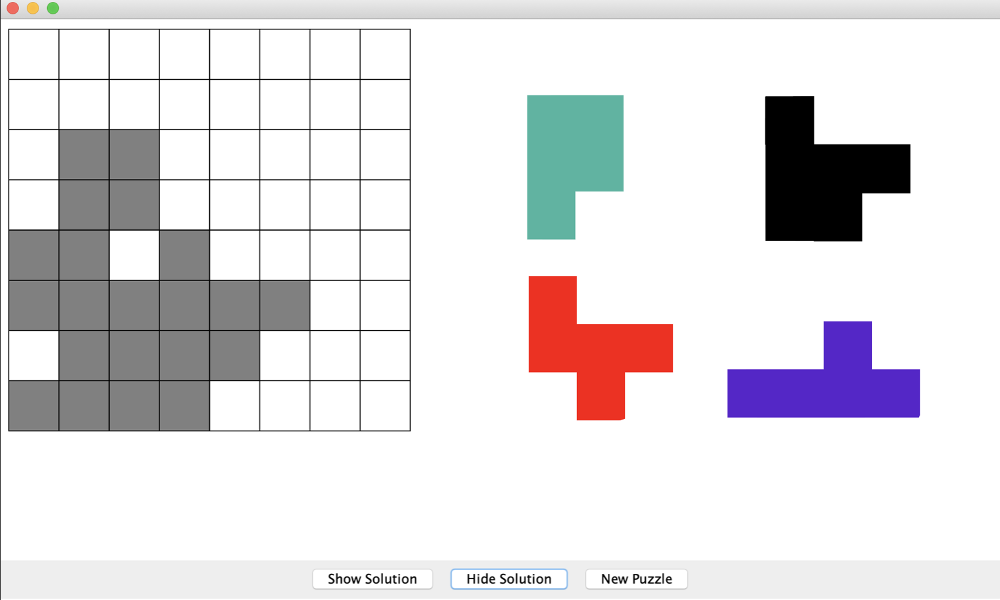
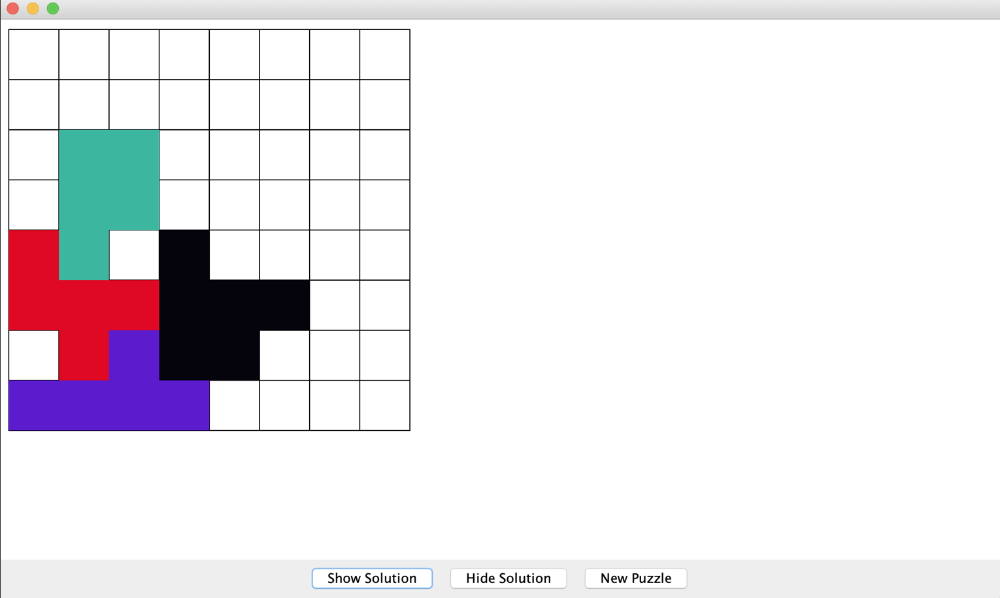

# Tiling Puzzle
This project is a game which the user can drag the polyominoes to complete the puzzle (shaded area) that is being generated by the program. In short, it is similar to the game, [Tangram](https://www.mathplayground.com/mobile/tangram_fullscreen.htm). 

## Design
### Back End:
In this project, we utilize the MVC architectural pattern. The most important part of this project is the algorithm that randomly generates the puzzle each time the user requests a new game. We use the `Tile` class to keep track of the color of the current tile that we are looking at. The algorithm picks a random position in a 8x8 board, and goes to either right, left, up, or down to get to the next piece of a polyomino until it reaches 8 tiles. During the process of making a polyomino, there is a `visited` list so that the algorithm doesn't check the select the block that is already visited. After one is done, a `while` loop handles to generate 4 different polyominoes. 

### Front End:
With our `view` implementations, the canvas displays the board with shaded area on the left as well as a collection of polymonioes on the right. With decoupling method, we connect the `model` and the `view` using the `controller` implementation where the `view` calls functions from the `model` indirectly through the `controller`. As in the `controller` implementation, we not only enable the functionality to drag the polyominoes to play the game but also to show solution, hide solution, or acquire a new puzzle. 

## Snapshots
The first snapshot demonstrates what the game initially looks like. It displays the board as well as the polyominoes for the puzzle.

The second snapshot demonstrates the game state after all the polyonomies are correctly placed.

## Future Implementations
Besides the current implementations of the game, we have decided to add difficulty levels to the game with different sizes of boards and polyominoes. There is also a possiblity for users to customize the difficulty (By inputing the desired board size, number of polyominoes, and/or number of blocks per each polyominoe.) Additionally, we hope to transform it into an app in the future.

## Creators
[Cindy Luo](https://github.com/cindy1u0) & [Amy Ying](https://github.com/amywhying)
